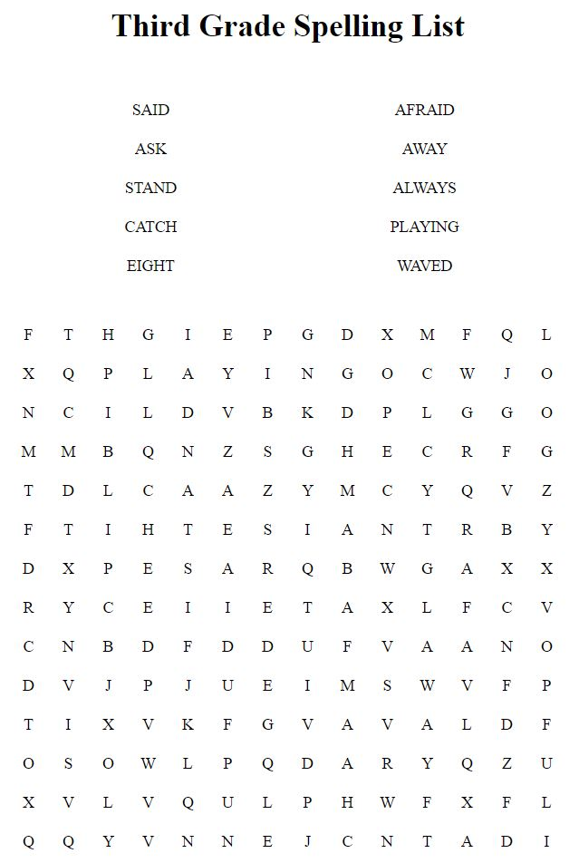

# Word_Search_Gen
###### Description
This app generates a word search from a list of up to 10 words you enter!  

<!-- [Click here to live link](https://quizzler-app.herokuapp.com/) -->

## Contributors
* mwturner611

## Technology
Heroku, JavaScript, HTML and CSS 

## Table of Contents
* [Top of Page](#description)
* [Technologies Used](#technologies)
* [Usage](#usage)
* [License](#license)
* [Contributing](#contributing)
* [Contacts](#contacts)

## Pictures

## Usage 
1. On the home page enter the title of your word search and up to 10 "search words".
2. You can reset if you'd like to clear the form.
3. Click "submit" to generate the wordsearch.
4. Your word search words are randomly hidden in the word grid.  They can be horizontal,vertical or diagnal.
5. Click "Print" to creat a printable version from your browser.

## License
This project is licensed under The MIT License (MIT).

## Contributing Guidelines
All contributions and suggestions are welcome! For direct contributions, please fork the repository and file a pull request.

## Contacts
* Name: Matt Turner (@mwturner611)
* e-mail: mwturner611@gmail.com
* LinkedIn: https://www.linkedin.com/in/matt-turner-ba328211a/*# 